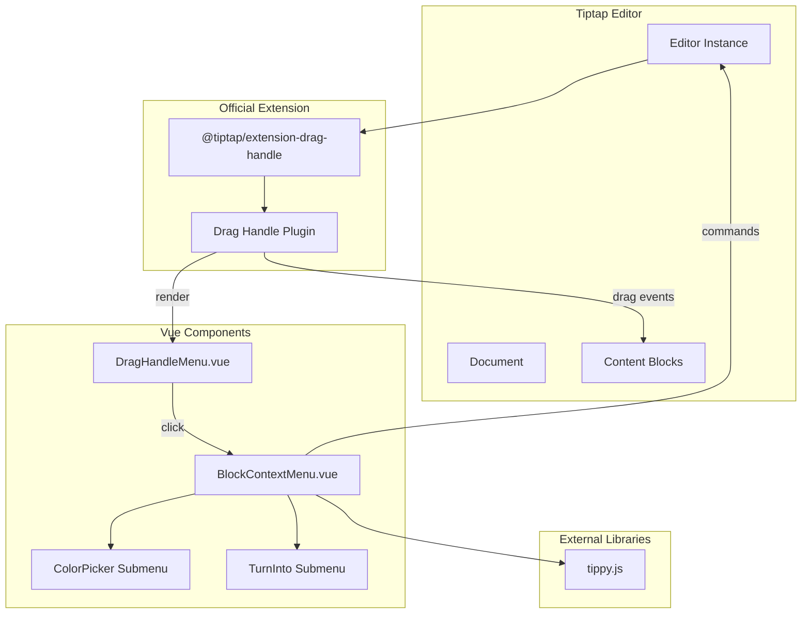

# Design Document: Drag Handle

## Overview

本设计为 Tiptap 富文本编辑器实现块级拖拽手柄（Drag Handle）功能。该功能允许用户通过悬停在内容块左侧来显示拖拽手柄，支持拖拽重排序和点击打开上下文菜单进行块级操作。

设计基于官方 `@tiptap/extension-drag-handle` 扩展，结合 Vue 3 组件和 tippy.js 实现上下文菜单，与现有的 SlashCommand 和 BubbleMenu 保持一致的技术栈和交互模式。

## Architecture



### 技术选型

- **@tiptap/extension-drag-handle**: 官方拖拽手柄扩展，提供拖拽功能和悬停检测
- **Vue 3**: 渲染拖拽手柄内容和上下文菜单组件
- **tippy.js**: 管理上下文菜单的浮动定位和动画
- **@tiptap/extension-node-range**: 配合使用，支持多节点选择和操作

## Components and Interfaces

### 1. DragHandle Extension 配置 (src/utils/dragHandleConfig.js)

配置官方 `@tiptap/extension-drag-handle` 扩展，定义渲染内容和行为。

```typescript
import DragHandle from '@tiptap/extension-drag-handle'

// 扩展配置
DragHandle.configure({
  // 渲染拖拽手柄内容的函数
  render: () => {
    const element = document.createElement('div')
    element.classList.add('drag-handle')
    // 返回包含手柄图标和点击事件的元素
    return element
  },
  // 可选：自定义 tippy 选项
  tippyOptions: {
    placement: 'left',
    offset: [0, 0]
  },
  // 锁定轴向，只允许垂直拖拽
  lockAxis: 'y'
})
```

### 2. DragHandleMenu.vue (src/components/DragHandleMenu.vue)

拖拽手柄内容组件，包含拖拽图标和添加按钮，点击图标打开上下文菜单。

```typescript
interface DragHandleMenuProps {
  editor: Editor
}

interface DragHandleMenuEmits {
  (e: 'openMenu'): void
}
```

### 3. BlockContextMenu.vue (src/components/BlockContextMenu.vue)

上下文菜单组件，显示块级操作选项。

```typescript
interface ContextMenuItem {
  id: string
  label: string
  icon: string
  shortcut?: string
  submenu?: ContextMenuItem[]
  action?: (editor: Editor, blockInfo: BlockInfo) => void
  disabled?: (editor: Editor, blockInfo: BlockInfo) => boolean
}

interface BlockContextMenuProps {
  editor: Editor
  blockInfo: BlockInfo
  items: ContextMenuItem[]
}

interface BlockContextMenuEmits {
  (e: 'close'): void
  (e: 'action', item: ContextMenuItem): void
}
```

### 4. 预定义颜色配置

```typescript
interface BlockColor {
  name: string
  value: string  // CSS background-color value
  textColor?: string  // Optional text color for contrast
}

const BLOCK_COLORS: BlockColor[] = [
  { name: 'Default', value: 'transparent' },
  { name: 'Gray', value: '#f1f1f0' },
  { name: 'Brown', value: '#f4eeee' },
  { name: 'Orange', value: '#fbecdd' },
  { name: 'Yellow', value: '#fbf3db' },
  { name: 'Green', value: '#edf3ec' },
  { name: 'Blue', value: '#e7f3f8' },
  { name: 'Purple', value: '#f6f3f9' },
  { name: 'Pink', value: '#faf1f5' },
  { name: 'Red', value: '#fdebec' }
]
```

### 5. 块类型转换配置

```typescript
interface BlockTypeOption {
  type: string
  label: string
  icon: string
  attrs?: Record<string, any>
}

const BLOCK_TYPES: BlockTypeOption[] = [
  { type: 'paragraph', label: 'Text', icon: '¶' },
  { type: 'heading', label: 'Heading 1', icon: 'H1', attrs: { level: 1 } },
  { type: 'heading', label: 'Heading 2', icon: 'H2', attrs: { level: 2 } },
  { type: 'heading', label: 'Heading 3', icon: 'H3', attrs: { level: 3 } },
  { type: 'bulletList', label: 'Bullet List', icon: '•' },
  { type: 'orderedList', label: 'Numbered List', icon: '1.' },
  { type: 'codeBlock', label: 'Code Block', icon: '</>' },
  { type: 'blockquote', label: 'Quote', icon: '"' }
]
```

## Data Models

### BlockInfo 数据结构

```typescript
interface BlockInfo {
  // ProseMirror 节点
  node: ProseMirrorNode
  // 节点在文档中的位置
  pos: number
  // 对应的 DOM 元素
  dom: HTMLElement
  // 节点类型名称
  nodeType: string
  // 节点深度（用于嵌套内容）
  depth: number
}
```

### 拖拽状态

```typescript
interface DragState {
  isDragging: boolean
  sourceBlockInfo: BlockInfo | null
  dropTargetPos: number | null
  dropIndicatorY: number | null
}
```

### 上下文菜单状态

```typescript
interface ContextMenuState {
  isOpen: boolean
  blockInfo: BlockInfo | null
  activeSubmenu: string | null
}
```


## Correctness Properties

*A property is a characteristic or behavior that should hold true across all valid executions of a system-essentially, a formal statement about what the system should do. Properties serve as the bridge between human-readable specifications and machine-verifiable correctness guarantees.*

Based on the prework analysis, the following correctness properties have been identified:

### Property 1: Hover visibility toggle

*For any* content block and mouse position, when the mouse is within 50 pixels of the block's left edge, the drag handle visibility state should be true; when the mouse moves outside this area (and outside the handle), the visibility state should be false.

**Validates: Requirements 1.1, 1.2**

### Property 2: Block move preserves content

*For any* document with multiple blocks, and any valid source position and target position, moving a block from source to target should result in:
1. The block appearing at the target position
2. The block's content remaining identical
3. The total number of blocks remaining unchanged

**Validates: Requirements 2.3**

### Property 3: Invalid drop preserves document

*For any* document and any invalid drop operation (e.g., dropping onto itself, dropping outside valid positions), the document structure should remain completely unchanged.

**Validates: Requirements 2.4**

### Property 4: Menu header reflects block type

*For any* block type (paragraph, heading, list, blockquote, codeBlock), when the context menu is opened for that block, the menu header should display the correct block type name.

**Validates: Requirements 3.2**

### Property 5: Color application and persistence

*For any* block and any color from the predefined palette, applying the color should:
1. Set the block's background color attribute to the selected value
2. Persist the color in the document's serialized output

**Validates: Requirements 4.2, 4.4**

### Property 6: Block type conversion preserves text

*For any* block with text content and any valid target block type, converting the block should preserve all text content (including nested text for supported types).

**Validates: Requirements 5.2, 5.3**

### Property 7: Duplicate creates identical copy

*For any* block, duplicating it should create a new block immediately after the original with:
1. Identical node type
2. Identical text content
3. Identical attributes (including formatting)

**Validates: Requirements 6.1**

### Property 8: Delete removes block

*For any* document with at least 2 blocks and any block position, deleting the block should:
1. Remove exactly one block from the document
2. Reduce the total block count by one

**Validates: Requirements 6.3**

### Property 9: Reset formatting preserves text only

*For any* block with inline formatting (bold, italic, etc.), resetting formatting should:
1. Remove all inline marks from the block
2. Preserve the plain text content exactly

**Validates: Requirements 6.4**

### Property 10: Keyboard navigation cycles through items

*For any* context menu with N items, pressing ArrowDown N times from the first item should cycle back to the first item; pressing ArrowUp from the first item should select the last item.

**Validates: Requirements 7.2**

### Property 11: Handle appears for all block types

*For any* supported block type (Paragraph, Heading 1-6, BulletList, OrderedList, Blockquote, CodeBlock), hovering in the trigger area should cause the drag handle to appear.

**Validates: Requirements 8.1**

## Error Handling

### Invalid Operations

| Error Scenario | Handling Strategy |
|----------------|-------------------|
| Drop at invalid position | Cancel drag, return block to original position, no document change |
| Convert to unsupported type | Show notification, keep original block type |
| Clipboard API unavailable | Fall back to internal clipboard, show warning |
| Nested block conversion conflict | Flatten nested content to target type where possible |

### Edge Cases

- **Empty document**: Drag handle should not appear when there are no blocks
- **Single block**: Drag reordering disabled, only context menu operations available
- **Deeply nested content**: Operations affect the top-level block containing the nested content
- **Read-only mode**: Drag handle hidden when editor is not editable

## Testing Strategy

### Property-Based Testing

使用 `fast-check` 库进行属性测试，验证核心功能的正确性。

**配置要求**:
- 每个属性测试运行至少 100 次迭代
- 使用 `fc.assert` 和 `fc.property` 构建测试
- 每个测试必须标注对应的 Correctness Property

**测试文件**: `src/utils/dragHandle.test.js`

```javascript
import fc from 'fast-check'
import { describe, it, expect } from 'vitest'

// Example property test structure
describe('Drag Handle Properties', () => {
  it('Property 2: Block move preserves content', () => {
    fc.assert(
      fc.property(
        // generators for document, source pos, target pos
        fc.array(fc.string(), { minLength: 2, maxLength: 10 }),
        fc.nat(),
        fc.nat(),
        (blocks, sourceIdx, targetIdx) => {
          // ... test implementation
        }
      ),
      { numRuns: 100 }
    )
  })
})
```

### Unit Tests

单元测试覆盖具体示例和边界情况：

- 上下文菜单打开/关闭行为
- 颜色选择器 UI 交互
- 键盘快捷键触发
- 特定块类型的转换结果

### Integration Tests

集成测试验证组件协作：

- DragHandle 扩展与 TiptapEditor 的集成
- 上下文菜单与编辑器命令的交互
- 拖拽操作的完整流程

### Test Utilities

创建测试辅助函数：

```javascript
// src/utils/dragHandle.testUtils.js

/**
 * 创建测试用的编辑器实例
 */
export function createTestEditor(content) { /* ... */ }

/**
 * 生成随机块内容
 */
export function generateRandomBlock() { /* ... */ }

/**
 * 模拟拖拽操作
 */
export function simulateDragDrop(editor, sourcePos, targetPos) { /* ... */ }
```
