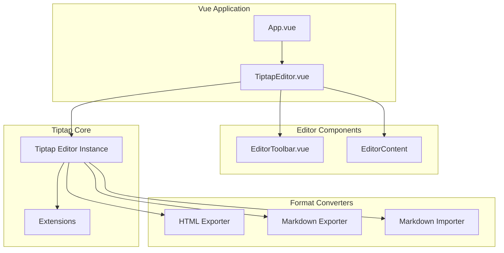

# Design Document

## Overview

本设计文档描述了基于 Tiptap 的富文本编辑器的技术架构和实现方案。编辑器将作为 Vue 3 组件实现，集成 Tiptap 核心库及其扩展，支持 Markdown 语法输入、HTML 和 Markdown 格式的导入导出功能。

## Architecture

编辑器采用组件化架构，主要分为以下层次：



## Components and Interfaces

### 1. TiptapEditor.vue (主编辑器组件)

主要职责：
- 初始化和管理 Tiptap 编辑器实例
- 提供内容导入导出的公共方法
- 协调工具栏和编辑区域的交互

```typescript
interface TiptapEditorProps {
  modelValue?: string;        // v-model 绑定的内容 (HTML)
  placeholder?: string;       // 占位符文本
  editable?: boolean;         // 是否可编辑
}

interface TiptapEditorEmits {
  'update:modelValue': (value: string) => void;
  'update': (editor: Editor) => void;
}

interface TiptapEditorExpose {
  getHTML(): string;
  setHTML(html: string): void;
  getMarkdown(): string;
  setMarkdown(markdown: string): void;
  getEditor(): Editor;
}
```

### 2. EditorToolbar.vue (工具栏组件)

主要职责：
- 渲染格式化按钮
- 响应按钮点击并调用编辑器命令
- 显示当前格式状态

```typescript
interface EditorToolbarProps {
  editor: Editor | null;
}

interface ToolbarButton {
  name: string;
  icon: string;
  title: string;
  action: () => void;
  isActive: () => boolean;
}
```

### 3. Format Converters (格式转换器)

#### markdownConverter.js

```typescript
interface MarkdownConverter {
  toMarkdown(html: string): string;
  toHTML(markdown: string): string;
}
```

## Data Models

### Editor State

```typescript
interface EditorState {
  content: JSONContent;       // ProseMirror 文档结构
  selection: Selection;       // 当前选区
  isActive: {                 // 当前激活的格式
    bold: boolean;
    italic: boolean;
    underline: boolean;
    strike: boolean;
    code: boolean;
    heading: number | null;
    bulletList: boolean;
    orderedList: boolean;
    blockquote: boolean;
    codeBlock: boolean;
  };
}
```

### Toolbar Configuration

```typescript
interface ToolbarConfig {
  groups: ToolbarGroup[];
}

interface ToolbarGroup {
  name: string;
  buttons: ToolbarButton[];
}
```

## Correctness Properties

*A property is a characteristic or behavior that should hold true across all valid executions of a system-essentially, a formal statement about what the system should do. Properties serve as the bridge between human-readable specifications and machine-verifiable correctness guarantees.*

Based on the prework analysis, the following properties have been identified:

### Property 1: HTML Round-Trip Consistency

*For any* valid editor content, exporting to HTML via `getHTML()` and then importing via `setHTML()` SHALL produce semantically equivalent content.

**Validates: Requirements 4.4**

### Property 2: Markdown Round-Trip Consistency

*For any* valid editor content containing supported elements (headings, lists, bold, italic, code blocks), exporting to Markdown via `getMarkdown()` and then importing via `setMarkdown()` SHALL preserve the semantic structure.

**Validates: Requirements 5.7**

### Property 3: Formatting Toggle Consistency

*For any* text selection in the editor and any inline formatting type (bold, italic, underline, strikethrough), applying the format twice SHALL return the text to its original unformatted state.

**Validates: Requirements 1.2, 7.4**

### Property 4: Heading Level Conversion

*For any* paragraph content and any heading level from 1 to 6, applying the heading command SHALL convert the paragraph to the specified heading level, and the exported Markdown SHALL contain the corresponding number of "#" characters.

**Validates: Requirements 1.3, 5.2**

### Property 5: Markdown Syntax to Rich Text Conversion

*For any* valid Markdown string containing headings, lists, bold, italic, and code blocks, importing via `setMarkdown()` SHALL produce rich text content where each Markdown element is converted to its corresponding rich text format.

**Validates: Requirements 6.1, 6.2**

### Property 6: HTML Export Semantic Correctness

*For any* editor content with formatting (bold, italic, headings, lists), the `getHTML()` method SHALL produce valid HTML with semantically correct tags (strong, em, h1-h6, ul, ol, li).

**Validates: Requirements 4.1, 4.3**

## Error Handling

### HTML Import Errors
- Malformed HTML: 使用 DOMParser 解析，自动修复常见错误
- Unsupported tags: 保留文本内容，忽略不支持的标签
- XSS prevention: 使用 Tiptap 内置的 HTML 清理机制

### Markdown Import Errors
- Invalid syntax: 将无法解析的内容作为纯文本处理
- Unsupported elements: 忽略不支持的 Markdown 扩展语法

### Editor State Errors
- Empty content: 返回空段落标签 `<p></p>`
- Selection errors: 回退到文档开始位置

## Testing Strategy

### Property-Based Testing Library

使用 **fast-check** 作为属性测试库，配合 Vitest 测试框架。

### Unit Tests

单元测试覆盖以下场景：
- 编辑器初始化和销毁
- 工具栏按钮渲染和点击响应
- 特定 Markdown 快捷键触发
- 边界情况（空内容、特殊字符）

### Property-Based Tests

每个属性测试运行至少 100 次迭代：

1. **HTML Round-Trip Test**
   - 生成随机编辑器内容（包含各种格式组合）
   - 导出为 HTML，再导入
   - 验证内容语义等价

2. **Markdown Round-Trip Test**
   - 生成随机 Markdown 字符串
   - 导入后导出
   - 验证结构保持一致

3. **Formatting Toggle Test**
   - 生成随机文本和选区
   - 应用格式两次
   - 验证回到原始状态

4. **Heading Conversion Test**
   - 生成随机段落和标题级别
   - 应用标题命令
   - 验证 HTML 和 Markdown 输出正确

### Test Annotation Format

所有属性测试使用以下注释格式：
```javascript
// **Feature: tiptap-rich-editor, Property 1: HTML Round-Trip Consistency**
```

## Dependencies

### Required Packages

```json
{
  "@tiptap/vue-3": "^2.x",
  "@tiptap/starter-kit": "^2.x",
  "@tiptap/extension-underline": "^2.x",
  "@tiptap/extension-link": "^2.x",
  "@tiptap/extension-placeholder": "^2.x",
  "turndown": "^7.x",
  "marked": "^11.x"
}
```

### Dev Dependencies

```json
{
  "vitest": "^1.x",
  "fast-check": "^3.x",
  "@vue/test-utils": "^2.x",
  "jsdom": "^24.x"
}
```
